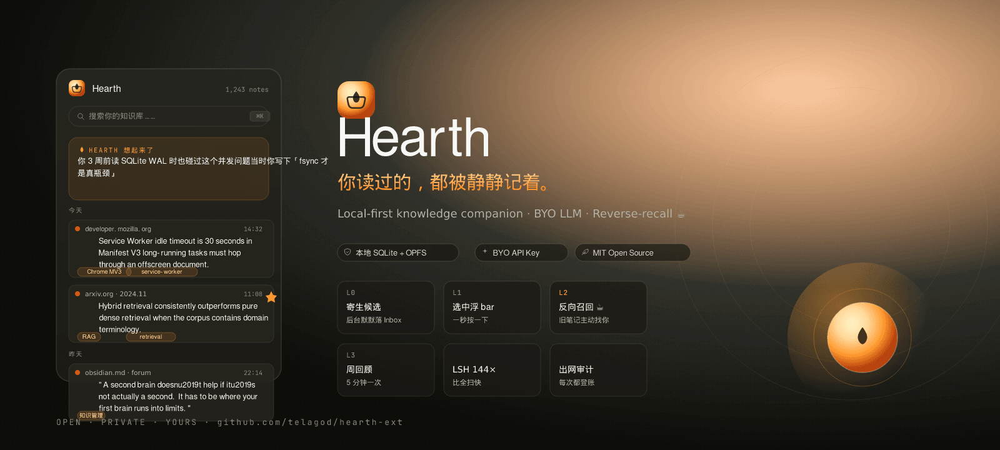
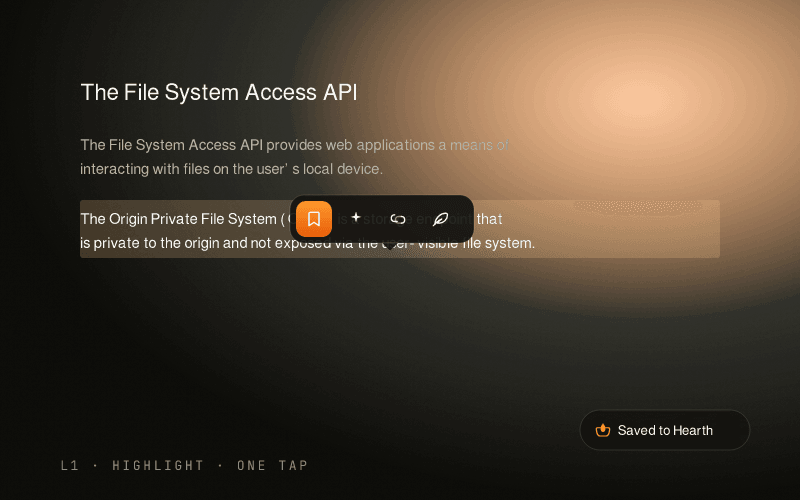
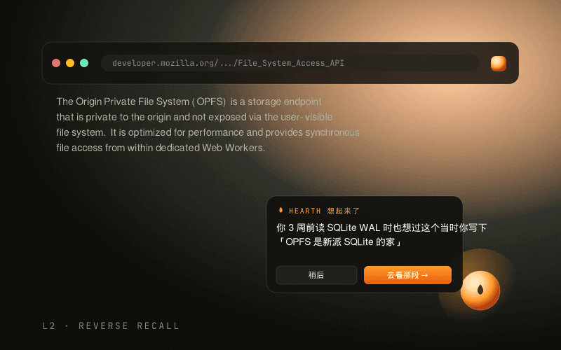
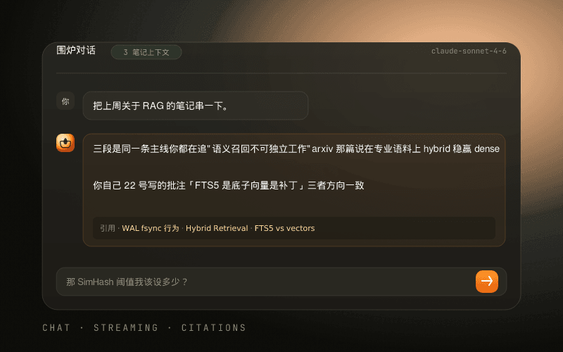

<div align="center">



# 🔥 Hearth

**Your reading, remembered. Quietly.**

把你在网上读过的每一段值得回看的话，
变成一团有温度、会主动找你的知识余烬。

[](docs/SMOKE.md)
[](LICENSE)
[]()
[](tests/)
[]()
[]()

🌐 **[telagod.github.io/hearth-ext](https://telagod.github.io/hearth-ext/)** · 演示站&nbsp;&nbsp;|&nbsp;&nbsp;
🎨 **[设计稿](https://telagod.github.io/hearth-ext/mockup.html)** &nbsp;&nbsp;|&nbsp;&nbsp;
📚 **[文档](https://telagod.github.io/hearth-ext/docs.html)**

</div>

---

## 三件事一起做

<table>
<tr>
<td width="33%" align="center">
  
  <br><sub><b>L1 · 选中即收</b><br/>浮 bar 一秒按下，回头随时回看</sub>
</td>
<td width="33%" align="center">
  
  <br><sub><b>L2 · 反向召回 ☕</b><br/>新页面命中旧笔记，浮起轻声提醒</sub>
</td>
<td width="33%" align="center">
  
  <br><sub><b>围炉对话</b><br/>以你笔记为上下文，引用你自己的话</sub>
</td>
</tr>
</table>

---

## ✨ Hearth 不是什么

不是 ChatGPT 套壳。不是 Notion 第二大脑。不是 Evernote 现代版。

## ✨ Hearth 是什么

一款 **本地优先** 的 Chromium 浏览器插件，让你**读过的旧笔记主动找你**。

```
☕ Hearth 想起来了：
   你 3 周前读 SQLite WAL 时也思考过这个并发问题，
   当时你的批注是「fsync 才是真瓶颈」。
   要看那段笔记吗？
```

不是冷冰冰的"3 条相关结果"——而是**像火炉边的朋友**轻声提醒。

---

## 🔥 核心特性

### 四层摩擦阶梯 · 用户全程不必主动开主界面

| 层 | 触发 | 你的姿势 |
|---|---|---|
| **L0** 寄生候选 | 复制 / 深度阅读 / 截图 | 不用做任何事 |
| **L1** 选中浮 bar | 选中任意文本 | 一秒按一下 |
| **L2** 反向召回 | 打开任意新页面 | 看 Hearth 主动找上门 |
| **L3** 周回顾 | 每周一 9 点 | 5 分钟刷一遍 |

### 温度引擎（Warmth Engine）

差异化命门。**LLM 不做"对话陪伴"，做"知识管家旁白"**。

- FTS5 + SimHash 本地粗筛（无 30MB 嵌入模型）
- LLM 仅看标题与你的批注，**不发全文**
- 旁白语气短、有温度，引用你自己的原话

### skill.md 自动化编排

线性、可解释、沙箱化。**不是 LangGraph，不是 CrewAI**。

5 个内置 skill：
- `weekly-review` · 每周一聚合上周高亮成主题卡
- `tag-suggest` · 入库自动建议 3 个标签
- `link-similar` · 异步寻找相关并加 wiki link
- `inbox-tidy` · 每日清理候选 Inbox
- `monthly-purge` · 每月冷藏 30 天未访问且 0 星标

### Office / 图片 = 输入源（不是编辑器）

- `.docx` → mammoth 抽文 → 当普通笔记入库
- `.pdf` → pdf.js 抽文+页码 → 入库
- 图片 → Tesseract OCR（按需 lazy install）→ 入库

### 隐私保护

- **三层数据分级**：候选 / 入库 / 元信息，逐层不同出网规则
- **出网三戒**：明示、最小、可控
- **审计日志**：每次外部调用都落账；设置面板查"过去 7 天云端调用"
- **域名黑名单**：bank / mail / 政府站默认不采集

### 数据本地化与导出

```
hearth-export.zip
├── hearth.db            # 完整 SQLite
├── notes/
│   └── *.md             # 全部 markdown 笔记（可直接做 Obsidian Vault）
├── skills/
│   └── *.md             # 你的 skill 文件
└── settings.json
```

---

## 📦 项目结构

```
.
├── docs/
│   ├── PRD.md                ⭐ 产品立意与对标
│   ├── ARCHITECTURE.md       ⭐ 模块/数据流/隐私边界
│   ├── DATABASE.md           ⭐ Schema 速览
│   └── SKILL_SPEC.md         ⭐ skill.md 规范 v1.0
├── mockups/
│   └── index.html            🎨 漂亮的 UI 设计稿（直接浏览器打开）
├── src/
│   ├── background/           Service Worker（router/capture/skill runner/alarms）
│   ├── content/              Float bar + Recall orb + Inbox probe
│   ├── sidepanel/            React 主壳（Library/Chat/Inbox/Skills/Settings）
│   ├── offscreen/            SQLite WASM + FTS5 + SimHash + 抽文管线
│   ├── newtab/               Dashboard（今日记忆/热力图/快捷搜索）
│   ├── shared/               Types + 消息总线
│   ├── llm/                  Adapter（Anthropic/OpenAI/Ollama/Custom）+ Warmth prompt
│   ├── db/                   DDL + migrations
│   └── i18n/                 zh / en
├── skills_examples/          5 个内置 skill 样本
└── public/manifest.json      MV3 manifest
```

---

## 🚀 开发

```bash
# 装依赖（需 node >= 20）
npm install

# 看 mockup（无需扩展环境，直接浏览器预览设计稿）
npm run mockup
# → http://localhost:5174

# 看演示站（landing + docs，无构建步）
cd site && python3 -m http.server 8765
# → http://localhost:8765

# 开发模式（vite watch 构建 dist/）
npm run dev

# 加载到 Chrome：
# chrome://extensions → 开启开发者模式 → 加载已解压 → 选 dist/
```

---

## 🗺 路线图

| 里程碑 | 周期 | 交付 |
|---|---|---|
| **M0 · 阵图** | W1 | PRD + 架构 + Mockup + 骨架 ✅ |
| **M1 · MVP** | W2-W4 | L1 浮 bar + Library + FTS5 + manifest 通过审核 ✅ |
| **M2 · 温度** | W5-W6 | L2 反向召回 + LLM BYOK + warmth + Chat ✅ |
| **M3 · 编排** | W7-W8 | Skill Engine + 5 个内置 skill + Inbox CRUD + 数据导出 + 流式 Chat ✅ |
| **M4 · 输入源** | W9-W10 | docx/pdf/img 抽文 + L0 候选探针 + 拖入 UI ✅ |
| **M4.5 · 打磨** | W10 | Skill 编辑器 + SPA 路由 + SimHash LSH ✅ |
| **M5 · 门面** | W11-W12 | Tesseract 本地化 + i18n + 演示站 + CWS 上架包 ✅ |
| **M6 · 上线运维** | W13+ | 真上架 + 演示站部署 + dogfood + 社区 skill 仓 |

---

## 📚 设计文档

| 文档 | 你能找到什么 |
|---|---|
| [PRD.md](docs/PRD.md) | 产品立意、对标矩阵、四层切入、温度引擎、隐私模型 |
| [ARCHITECTURE.md](docs/ARCHITECTURE.md) | 模块清单、数据流图、消息协议、安全权限、性能预算 |
| [DATABASE.md](docs/DATABASE.md) | SQLite schema、FTS5、SimHash、迁移策略、容量规划 |
| [SKILL_SPEC.md](docs/SKILL_SPEC.md) | skill.md 规范 v1.0、工具白名单、沙箱约束、反规范 |
| [BENCHMARK.md](docs/BENCHMARK.md) | 10k notes 实测 · LSH 144× speedup |
| [SMOKE.md](docs/SMOKE.md) | 逐里程碑加载步骤 + 体验清单 |
| [DEPLOY.md](docs/DEPLOY.md) | 演示站部署到 GitHub Pages（自动 + 手动两条路）|
| [STORE.md](docs/STORE.md) | Chrome Web Store 上架文案 + permission justification |

---

## 🎨 看 Mockup

打开 `mockups/index.html` —— 一份完整的设计稿，
覆盖 sidepanel 库/对话/Inbox/Skills、浮 bar、反向召回小球、隐私横幅。

Liquid Glass + 炉膛色（ink + ember）。深色优先，浅色自适应。

---

## 🛡 隐私契约

> **我们对你的数据做的承诺：**
>
> - ☑ 所有笔记存在你这台设备的 OPFS（SQLite WAL）
> - ☑ 任何外部调用都需要你 BYO API key
> - ☑ 任何外部调用都会被记账（设置面板查询）
> - ☑ 永远不上传任何遥测
> - ☑ 一键全量导出，可直接做 Obsidian Vault
> - ☐ 我们绝不绝不绝不**默认**开启自动嗅探

---

## 🤝 贡献

M0 阶段（当前）：欢迎对 PRD / 架构 / Skill 规范提 issue / discussion。

M1 起：欢迎代码 PR。所有 PR 走 `/verify-security` 与 `/verify-change` 关卡。

---

## 📜 License

MIT © 2026 hearth-team
